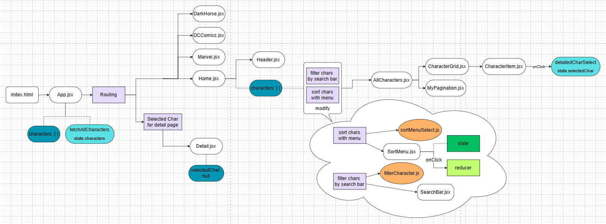
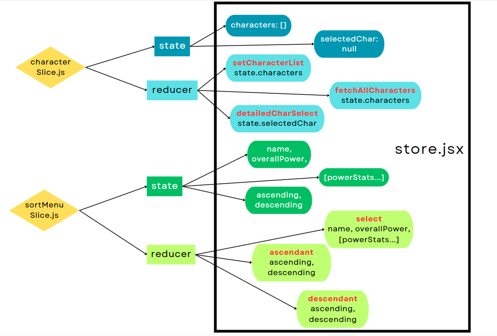

# Wiki Hero APP

This project is for React-Redux & Redux Toolkit learning purpose.

## General Description

> A React-Redux application with multiple componenets using [Super Hero API](https://cdn.jsdelivr.net/gh/akabab/superhero-api@0.3.0/api/all.json), Material UI and Axios to show, search and filter characters information.

## Table of content

[General Description](#general-description)

[Technologies](#technologies)

[Project Structure](#project-structure)

[Instruction](#instruction)

[React + Vite](#react--vite)

## Technology

-   JavaScript
-   React + Vite
-   HTML / CSS
-   Material UI
-   Axios
-   Routing (react-router-dom)
-   Redux Toolkit & React-Redux

## Project Structure

[src/](./src)

-   [app/](./src/app)
    -   [store.jsx](./src/app/store.jsx)
-   [components/](./src/components)
    -   [Header.jsx](./src/components/Header.jsx)
    -   [MyButtonsGroup.jsx](./src/components/MyButtonsGroup.jsx)
    -   [Spinner.jsx](./src/components/Spinner.jsx)
-   [features/](./src/features)
    -   [Character/](./src/features/Character)
        -   [AllCharacters.jsx](./src/features/Character/AllCharacters.jsx)
        -   [CharacterGrid.jsx](./src/features/Character/CharacterGrid.jsx)
        -   [CharacterItem.jsx](./src/features/Character/CharacterItem.jsx)
        -   [characterSlice.js](./src/features/Character/characterSlice.js)
        -   [MyPagination.jsx](./src/features/Character/MyPagination.jsx)
    -   [Routing/](./src/features/Routing)
        -   [DarkHorse.jsx](./src/features/Routing/DarkHorse.jsx)
        -   [DCComics.jsx](./src/features/Routing/DCComics.jsx)
        -   [Detail.jsx](./src/features/Routing/Detail.jsx)
        -   [Home.jsx](./src/features/Routing/Home.jsx)
        -   [Marvel.jsx](./src/features/Routing/Marvel.jsx)
    -   [Search_Bar/](./src/features/Search_Bar)
        -   [filterCharacter.js](./src/features/Search_Bar/filterCharacter.js)
        -   [SearchBar.jsx](./src/features/Search_Bar/SearchBar.jsx)
    -   [SortMenu/](./src/features/SortMenu)
        -   [SortMenu.jsx](./src/features/SortMenu/SortMenu.jsx)
        -   [sortMenuSelect.js](./src/features/SortMenu/sortMenuSelect.js)
        -   [sortMenuSlice.js](./src/features/SortMenu/sortMenuSlice.js)
-   [img/](./src/img)
    -   [bg.jpg](./src/img/bg.jpg)
    -   [dark_horse_bg.png](./src/img/dark_horse_bg.png)
    -   [dc_bg.jpg](./src/img/dc_bg.jpg)
    -   [DC_logo.png](./src/img/DC_logo.png)
    -   [dh_logo.png](./src/img/dh_logo.png)
    -   [favicon.ico](./src/img/favicon.ico)
    -   [hero.png](./src/img/hero.png)
    -   [marvel_bg.jpg](./src/img/marvel_bg.jpg)
    -   [Marvel_Logo.png](./src/img/Marvel_Logo.png)
    -   [spinner.gif](./src/img/spinner.gif)
-   [App.css](./src/App.css)
-   [App.jsx](./src/App.jsx)
-   [main.jsx](./src/main.jsx)




## Instruction

1. Open your terminal and clone the repository with the following command:

```
git clone https://github.com/TinNguyen01600/WikiHero
```

2. Install all the packages:

```
npm install
```

3. Start the application in your local machine:

```
npm run dev
```

\*\* Or simply access the deployed version on Netlify (https://tin-nguyen-wikihero.netlify.app/).

<pre>
Package use: 
    @mui/icons-material: 5.14.19
    @mui/material: 5.14.20
    @reduxjs/toolkit: 2.0.1
    axios: 1.6.2
    react: 18.2.0
    react-dom: 18.2.0
    react-redux: 9.0.3
    react-router-dom: 6.20.1
</pre>

## React + Vite

This template provides a minimal setup to get React working in Vite with HMR and some ESLint rules.

Currently, two official plugins are available:

-   [@vitejs/plugin-react](https://github.com/vitejs/vite-plugin-react/blob/main/packages/plugin-react/README.md) uses [Babel](https://babeljs.io/) for Fast Refresh
-   [@vitejs/plugin-react-swc](https://github.com/vitejs/vite-plugin-react-swc) uses [SWC](https://swc.rs/) for Fast Refresh
